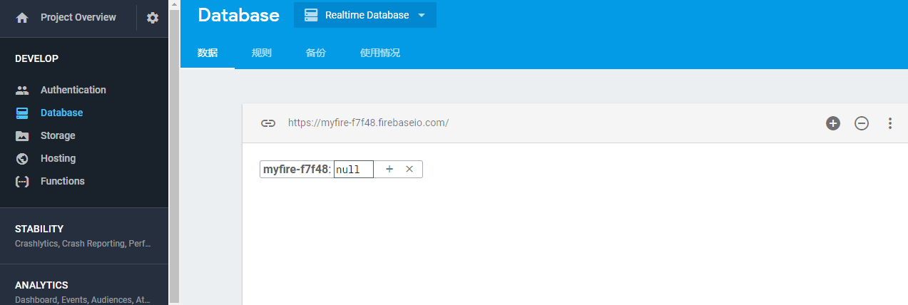
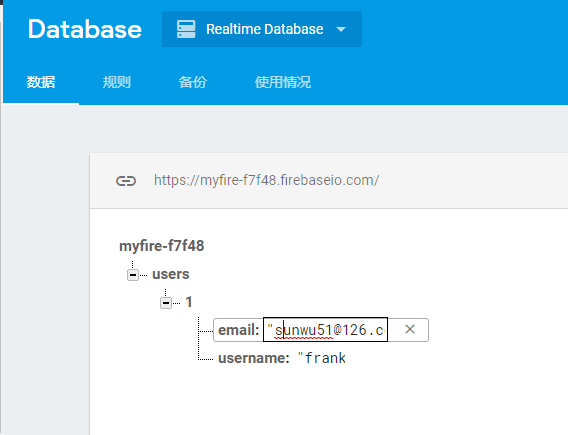
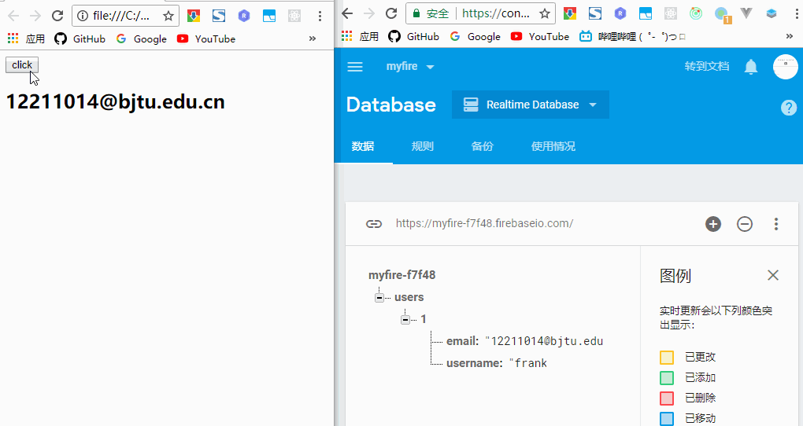

# firebase
firebase是谷歌提供的平台服务，这套服务非常强大。他是针对安卓ios或者web后台的，提供了像数据库云存储服务(nosql形式)、对象存储(如图片视频等)、静态网页资源cdn存储、身份认证、后台数据分析、实时监控、崩溃分析、消息推送系统等等，功能非常多，涵盖了后台的各方面。而且官网都有中文版本，我们来玩一下。
# 实时数据库
用谷歌账号登录firebase首页，创建一个应用后进入控制台。  
  
在这个页面点击，ios或安卓或web任意一项可以弹出，对应的嵌入代码。后面会用到。
左侧develop->Database，创建自己的数据库  
  
这里我选择用网页端进行数据读写，也可以选择安卓ios以及nodejs客户端等方式。我们回到上一张图的页面，点一下web的图标，就弹出一段代码，复制到一个html文件中即可。
添加一个按钮来测试下添加数据
```html
<button onclick="add()">click</button>
<script src="https://www.gstatic.com/firebasejs/4.10.0/firebase.js"></script>
<script src="https://www.gstatic.com/firebasejs/4.6.2/firebase-database.js"></script>
<script>
  // Initialize Firebase
  var config = {
    apiKey: "填自己的",
    authDomain: "填自己的",
    databaseURL: "填自己的",
    projectId: "填自己的",
    storageBucket: "填自己的",
    messagingSenderId: "填自己的"
  };
  firebase.initializeApp(config);
  function writeUserData(userId, name, email) {
	  firebase.database().ref('users/' + userId).set({
		username: name,
		email: email
	  });
  }
  function add(){
	writeUserData(1,"frank","sunwu51@126.com")
  }
</script>
```
点击按钮后数据就已经被添加了，到控制台下就可以看到  
  
另外数据读取修改删除等操作类似，可以[参考官方文档](https://firebase.google.com/docs/database/web/read-and-write?authuser=0)  
实时数据库是firebase提供的最主要功能之一，我们从上面的例子发现这是一个类似mongodb的nosql的json数据库，除了基本增删改查，这个数据库还有个“实时性”，每个客户端是socket连接的服务端，可以监听数据的变化进行实时改变。  


其他功能看着也很爽，比如静态页面部署，相当于送你一个cdn服务器。还有Function功能可以做维护，不过可惜的是我运行`firebase login`指令一直出错，这些就都没有尝试。
# 小结
总之，firebase还是非常强大的，我这里只介绍了几十种功能中最简单的一种。感兴趣的可以自己去了解更多。
