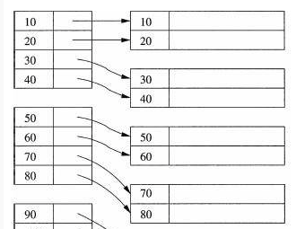

# 查找
# 1 概述
最容易想到的查找就是顺序查找，挨个遍历元素，直到找到目标元素。列表有序则有更好的查找方法，比如`二分查找法`、`插值查找法`、`斐波那契查找法`。

但是如果数据量很大列表排序在存储的时候很难实现，此时可能使用索引查找，有一一对应形式的`稠密索引`，图书馆一样的`分块索引`(块内无序，块间有序)，搜索引擎常用到的用属性索引存储位置的`倒排索引`。

另一种存储形式是树形存储，如`二叉查找树`BST(又叫二叉排序树，二叉搜索树)即每个节点左侧都小于自己，右侧都大于自己。`平衡二叉树`AVL每个节点的左右子树的高度一样或差1的二叉查找树。`多路查找树`B树如2-3树，2节点有一个数据+2个孩子，3节点有俩数据+3个孩子，其孩子分布和内部元素分布满足左到右增大。

散列函数也经常用于做索引表，hash算法就有结果唯一性。
# 2 有序列表中查找
## 2.1 二分查找法
取头尾的下标为low high，然后看arr[(low+high)/2]的值和要找的比较，如果比要找的大，说明在前半段。则令`high=(low+high)/2-1`注意这里有个-1操作。依次类推。  

## 2.2 插值查找法
对于有序排列且分布均匀的数列来讲，使用二分查找有时候不如直接按比例查找。举例：列表中有50个数最小的是10最大的是100，现在找99这个数，如果二分查找则次数较多，我们一般直接从最后的位置找了。这就是插值查找的思路。`(target-arr[low]) / (arr[high]-arr[low])`来表示target要找的这个值如果是均匀分布的时候，在整个数组中的百分比位置。然后乘数组个数，从这查找。而非从中间了。
## 2.3 斐波那契查找
# 3 线性索引查找
## 3.1 稠密索引
将每个实际的值都建立一个索引的方式为稠密索引。  
  
## 3.2 分块索引（稀疏索引）
将数据进行分块，索引表中只记录块首的地址的方式。一般块内无序，块间有序。  
  
## 3.3 倒排索引
将文章中的单次作为索引的key，对应的value为文章的编号（可能有多个）  

# 4 二叉查找树BST
上面的查找都是基于线性存储结构或者线性索引的，二叉查找树则是树形存储结构。其特点前面讲过就是，左孩子<本节点<右孩子.  
  

## 4.1 插入与删除
插入较为简单，只需要从根节点开始比较，找到合适的位置挂上去即可。

删除则略显复杂，思路上最简单的方式为，将删除的节点的所有左(或右)孩子们重新插入，但是重新插入的代价较高。比较好的解决方案是，将要删除节点的左孩子的最后一个右孩子 拿到这个删除节点的位置进行替换。（或者右孩子的最后一个左孩子）。

上述操作的依据是：左孩子们一定是比原值小，而左孩子中最右的那个一定是，比原值小的里面最大的那个，即其他左孩子都小于他。`其他左孩子<最右左孩子<原值<所有右孩子`。所以这个值可以直接替换原值。

# 5 平衡二叉树AVL
AVL树是一种BST，只不过他需要满足所有节点的左树和右树的高度一样或差一（平衡因子0、1或-1）

