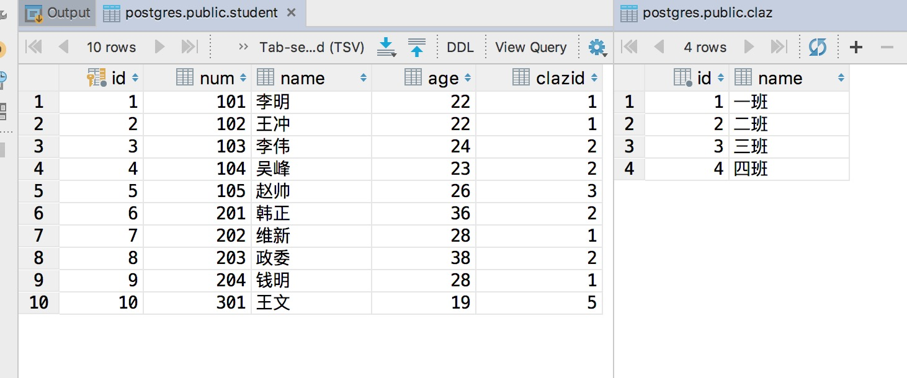

# SQL
# 1 join
`join`分为四种，`join`（等价于`inner join`）、`left join`、`right join`、`full join`，因为mysql不支持full join所以我们选用postgresql进行测试。 
以下面两个表为例：


```sql
select
  student.name as 姓名,
  student.age as 年龄,
  student.num as 学号,
  claz.name as 班级
from student
  join claz on student.clazid = claz.id
```
join结果
```
李明	22	101	一班
王冲	22	102	一班
李伟	24	103	二班
吴峰	23	104	二班
赵帅	26	105	三班
韩正	36	201	二班
维新	28	202	一班
政委	38	203	二班
钱明	28	204	一班
```
将sql中join改为`left join`
```
李明	22	101	一班
王冲	22	102	一班
李伟	24	103	二班
吴峰	23	104	二班
赵帅	26	105	三班
韩正	36	201	二班
维新	28	202	一班
政委	38	203	二班
钱明	28	204	一班
王文	19	301	NULL
```
将sql中join改为`right join`
```
李明	22	101	一班
王冲	22	102	一班
李伟	24	103	二班
吴峰	23	104	二班
赵帅	26	105	三班
韩正	36	201	二班
维新	28	202	一班
政委	38	203	二班
钱明	28	204	一班
NULL	NULL    NULL	四班
```
将sql中join改为full join
```
李明	22	101	一班
王冲	22	102	一班
李伟	24	103	二班
吴峰	23	104	二班
赵帅	26	105	三班
韩正	36	201	二班
维新	28	202	一班
政委	38	203	二班
钱明	28	204	一班
王文	19	301	NULL
NULL    NULL    NULL	四班
```
各自作用显而易见了。  
`where group order`的嵌入：
```sql
select
  sum(student.age) as 年龄和,
  claz.name as 班级
from student
  join claz on student.clazid = claz.id
where student.age>20 
group by 班级 
order by 年龄和 DESC
```
```
121	二班
100	一班
26	三班
```
# 2 行号
`row_number() over()`可以求行号例如
```sql
select *,row_number() over() as row_num
from student;
```
单纯的行号似乎没有什么作用，该函数的over()部分可以分组，对每一组分别再加行号。
```sql
select name,clazid,row_number() over(partition by clazid order by clazid) as row_num
from student;
```
如上按照班级分组，每组进行编号，结果如下
```
name    clazid  row_num
钱明	1	1
李明	1	2
维新	1	3
王冲	1	4
韩正	2	1
李伟	2	2
吴峰	2	3
政委	2	4
赵帅	3	1
王文	5	1
```
这就是row_number() over(partition by)的使用方法了，通过该功能我们很容易可以选出每个班的人中，年龄最大的一个等这样的，分区选出固定个数的查询。
```sql
select * from (
select name,age,clazid,row_number()
over(partition by clazid order by age) as row_num
from student  )T where row_num=1
```