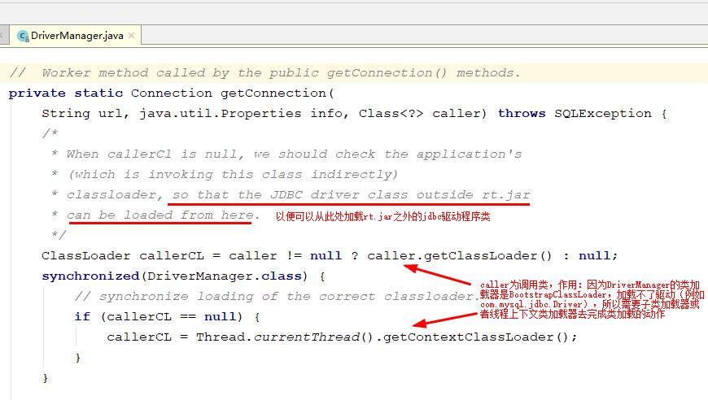

# jvm类加载
[干货文章，科普移步]

类加载机制为双亲委派：

即查看`当前类加载器`是否加载了该类，如果没有则看`该类加载器`的`父亲`，有没有加载过该类，一直往上找，任意一个加载器加载过该类都不用再加载。如果都没有则当前上下文类加载器去加载。

类加载器有四种父子关系如下：
```
BootstrapClassLoader(加载核心库JRE/lib/rt.jar)
         ⬇️
ExtensionClassLoader(加载扩展库JRE/lib/ext/*.jar)
         ⬇️
APP ClassLoader(加载classpath/*.jar)
         ⬇️
Custom ClassLoader(自定义的加载器)
```
# 探索
```java
public class ClassLoaderTest{ 
    public static void main(String[]args) { 
        ClassLoader loader = ClassLoaderTest.class.getClassLoader(); 
        while(loader!=null){ 
            System.out.println(loader.getClass().getName()); 
            loader = loader.getParent(); 
        } 
        System.out.println(loader); 
    } 
} 
/*
sun.misc.Launcher$AppClassLoader
sun.misc.Launcher$ExtClassLoader
null
结论：我们普通的类都是用AppClassLoader加载的，他的父亲是Ext，Ext父亲是null，因为Boot返回的就是null，可以参考https://stackoverflow.com/questions/1921238/getclass-getclassloader-is-null-why
*/
```
```java
ClassLoader loader = Main.class.getClassLoader();
System.out.println(loader);

loader = DNSNameService.class.getClassLoader();//DNSNameService是JRE/lib/ext/dnsns.jar下的包
System.out.println(loader);

loader = String.class.getClassLoader();
System.out.println(loader);
/*
sun.misc.Launcher$AppClassLoader
sun.misc.Launcher$ExtClassLoader
null
结论：自己的类是app加载器加载，ext加载ext目录下jar包，boot加载rt.jar如java.lang.*
*/
```
# 注意
!!!**注意，A是在B类中new的，那么A的当前类加载器就是加载了B类的加载器。即一下两种写法等价。**
```java
// 1
public class B{
    void f(){
        new A();
    }
}
// 2
public class B{
    void f(){
        this.getClass().getClassLoader().loadClass(A.class.getName());
    }
}
```
# 自定义类加载器
直接上代码：
```java
public class MyClassLoader extends ClassLoader{
    public MyClassLoader(){}
    public MyClassLoader(ClassLoader parent){
        super(parent);
    }
    @Override
    public Class<?> loadClass(String name) {
        String myPath = "file:///Users/frank/code/trantest/target/classes/" 
            + name.replace(".","/") + ".class";
        byte[] cLassBytes = null;
        Path path = null;
        try {
            path = Paths.get(new URI(myPath));
            cLassBytes = Files.readAllBytes(path);
        } catch (IOException | URISyntaxException e) {
            try {
                // 没找到文件，则调用父类方法，父类中是双亲委派的实现方式。
                return super.loadClass(name);
            }
            catch (Exception e1){
                e1.printStackTrace();
            }
        }
        Class clazz = defineClass(name, cLassBytes, 0, cLassBytes.length);
        return clazz;
    }
}
```
主要是继承ClassLoader类，然后重写了loadClass方法，ClassLoader中的loadClass方法就是双亲委派的具体实现方法，这里打破双亲委派，先从指定目录下加载class文件，如果有则加载成功并返回class对象。如果没有则调用父类的loadClass方法，并返回。

注意这里我声明了两个构造方法。无参构造方法父加载器就是APP，传参构造方法就是设置该参数为父类加载器。【注意：父类加载器 != 当前类加载器的父类】

声明两个测试类
```java
class A{
    void fa(){
        System.out.println(this.getClass().getClassLoader());
    }
    void fb(){
        B b = new B();
        System.out.println(b.getClass().getClassLoader());
    }
}
class B{

}
```
```java
//main函数
MyClassLoader m = new MyClassLoader();
Class c = m.loadClass("A");
Object a = c.newInstance();

c.getMethod("fa").invoke(a); 
// 打印MyClassLoader@27bc2616说明a对象是用自定义加载器加载的

c.getMethod("fb").invoke(a); 
// 打印MyClassLoader@27bc2616说明a中声明的b对象是用a的类加载器加载的
```
小结：上面的例子说明了，通过重写loadClass方法就可以打破双亲委派。但是有些不能全部重写，比如所有对象都继承自Object对象，而这个对象我们没有必要自己加载。所以例子中我设置了我们自己路径下的class文件才进行装载，否则还是走双亲委派。

关于b的ClassLoader，因为在A中被new所以是用a的加载器.loadClass。因为这里的B也在我们的class文件路径下，所以直接就用a的加载器加载了。
## 变种1
如果刚才的例子中我们把B类在自定义类加载器中排除加载，交给super.loadClass即运行双亲委派。
```java
if(myPath.contains("B.class")){
    try {
        return super.loadClass(name);
    }
    catch (Exception e1){
        e1.printStackTrace();
    }
}
```
这样a中`new B`的时候，B加载还是用这个加载器，不过在load函数中直接把B的加载交给了双亲模式。双亲模式下：B先找到当前加载器MyClassLoader，发现并没有加载过B；然后找到My的父加载器APP，之后就是调用APP的loadClass函数了（就和我们平时new对象一样了），后面会一直调用到BOOT，最后回到APP，然后由APP加载。
```java
c.getMethod("fb").invoke(a); 
//此时打印 AppClassLoader
```
# 变种2
在变种1的基础上，自定义加载器默认parent是APP，我们给强行改成Ext，即自定义加载器和APP同级别的都是父亲是EXT。
```java
MyClassLoader m = new MyClassLoader(Main.class.getClassLoader().getParent());
...
c.getMethod("fb").invoke(a); 
//ClassNotFoundException
```
因为父类加载器Ext和Boot都无法加载，自己又是抛出去的所以，最后炸了。

# 场景1
Boot加载的类中需要new一个App才能加载的类，Boot加载不了，所以就异常了。这种时候怎么办？这就是jdbc驱动类加载的方式。盗图一张：  
  
这里看出是从线程上下文拿的类加载器，如果是普通的用户程序这个加载器是APP。注意：这里获取的线程上下文类加载器，并不是我们所说的当前类加载器，他只是线程的执行中的一个暂时存储的类加载器，类似于ThreadLocal一样的一个线程专有的存储空间，正常情况下都是APP，除非自己set。
# 场景2
应用依赖于B,C。B依赖于`A-1.0.jar`，C依赖于`A-1.1.jar`。即依赖冲突，如何解决？

jvm判断这个类已经被加载的依据是`全类名`和`类加载器`都一样才算被加载了，如果例如jvm中可能存在两个A类，他们分别用不同的类加载器加载的。

那也就是说我们分别用不同的类加载器，加载A的1.0和1.1两个版本进来就行了。不过在什么地方加载就是个问题了。因为其实new A来用A对象，这时候是当前类的加载器去加载的。所以我们本质上是需要对
BC两个依赖在加载的时候全部使用不同的加载器。

思路：重写main方法，让他在一个新的加载器下而非APP下运行，这个加载器叫`L1`，之后在运行中new的类都是由`L1`加载了，`L1`里是个判断，判断类的路径是B包的，则用加载器`L2`，如果是C包的，则用加载器`L3`。`L2``L3`和APP的实现类似。

这样new B的时候是L2加载的，然后B内运行有new A的地方则用的是`L2`加载的。如果是C的话就是L3加载的，C内运行new A的地方也就是用的`L3`加载了。

