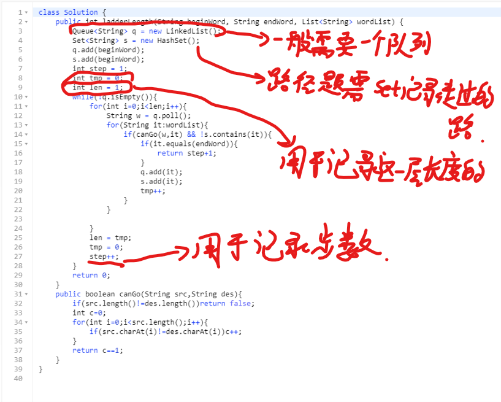
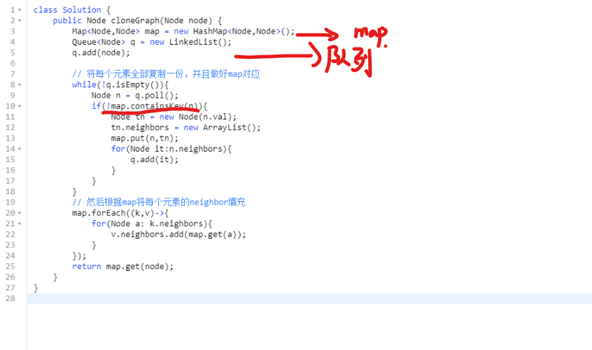
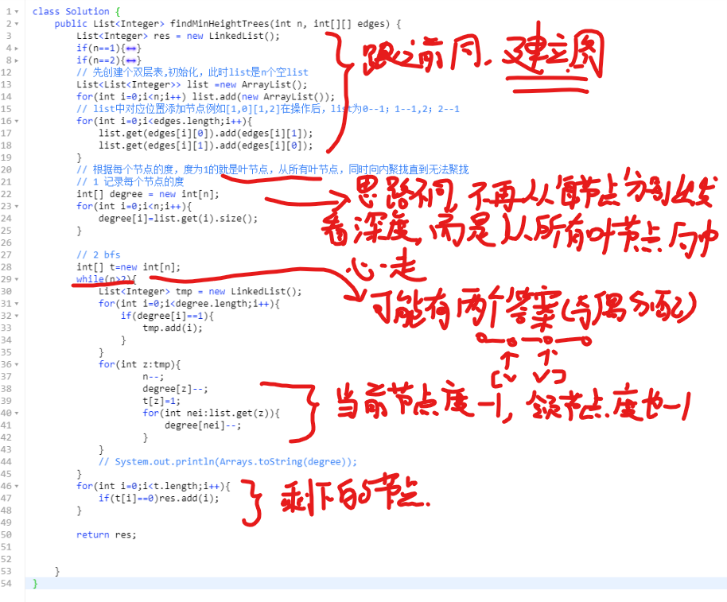
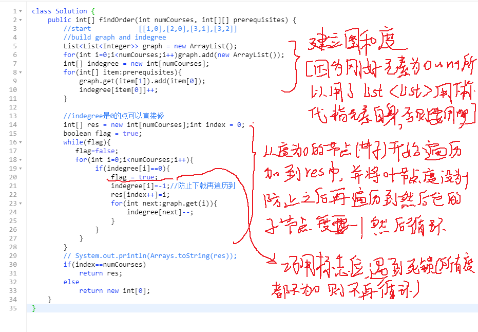

# BFS
bfs也是非常重要的算法解决方式，很多最短路径相关的题目都会使用BFS，因为已经遍历的元素不需要再次被遍历，所以不会有DFS遍历的时候重复遍历同一个元素的情况。且能在最短的第n层就求出并结束。

最初接触BFS应该就是关于二叉树的BFS和BFS直接相关的题目，例如z字遍历等。基本思路都是通过队列存储的方式。

**关键字：最短路径、能否到达、图**

# BFS编程的几个特点
- 1 q和set，需要有个Queue记录本层节点，同时需要有个set记录走过的节点，如果是图则是防止走回头路
- 2 单层遍历，一般循环需要单层遍历，所以while后一般有个求q.size的操作，或者可以用len记录每层的节点数
- 3 候选与筛选，一般下一层的节点需要和本层邻接，并且set中没有，这是主要的筛选票件。
# 经典题目
**1 给定起始单词和结束单词，单词每次只能变化一个字母，给定一个变化列表，求变化到结束单词最少需要的步数。如起始hit结束cog，列表[hot,dot,dog,lot,log,cog]就可以hit-hot-dot-dog-cog一共是5步**  
通过最短路径关键字判断使用bfs求解  
  
**2 图的复制，图节点有val和neighbor字段**  
通过图关键字判断使用bfs，这里解法并非最优，但最好理解
   
**3 无向图选择根节点，形成树，求能让树深度最小的root节点应该怎么选。有n个节点，每个节点为0-n-1的数**  
  

！！！上面的解法在bfs时遇到一个困惑，图没有root，所以不知道从哪个节点开始走。所以就分别从每个节点走了一遍。其实是非常低效的，虽然图没有根，但是有叶，可以从所有的叶节点逐步向中心靠拢。有如下解法。

  

**4 选课，课程数n，课程用0~n-1表示，课程有依赖关系如[0,1]表示0课程依赖于1课程的先修，问给个依赖表，能否修满n节课，能的话修的课程顺序是怎么样的**  
  

